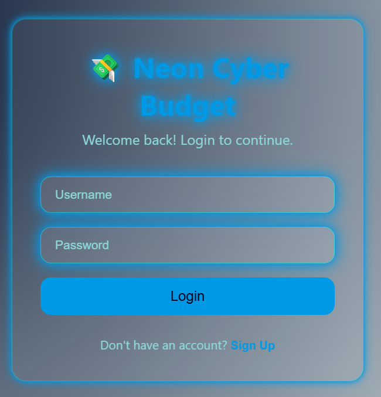
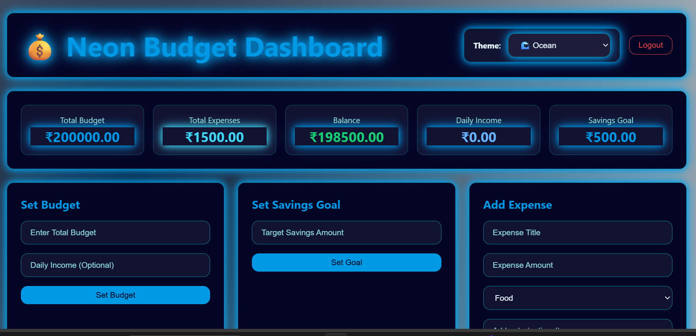
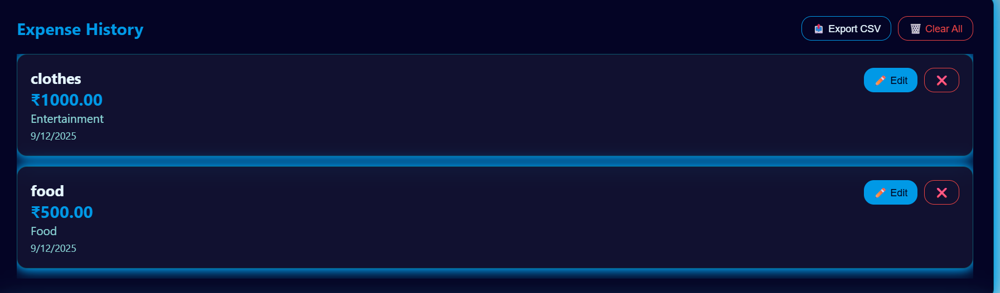
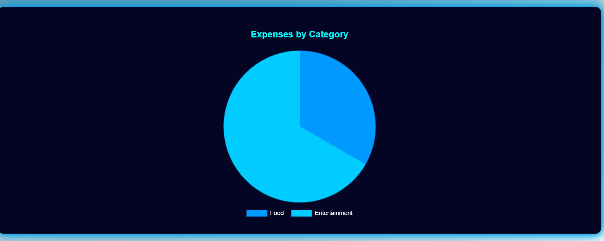
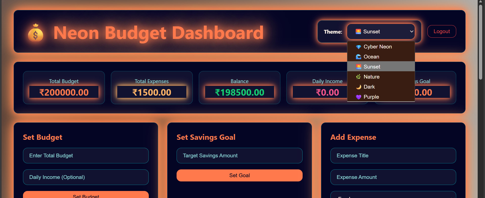

# 💸 Neon Cyber Budget

A modern, neon-themed budget tracking web app built with **HTML, CSS, and JavaScript**.  
Track your expenses, set budgets and savings goals, switch between neon themes, and visualize your spending with a dynamic pie chart — all in a stylish cyberpunk-inspired UI.

---

## ✨ Features

- 🔐 **Local Authentication (Frontend Only)**
  - Sign Up & Login using username and password
  - User data stored in `localStorage`
  - Auto-remembers the last logged-in user

- 💰 **Budget & Income Management**
  - Set your **total budget**
  - Add **optional daily income**
  - Automatic **balance calculation**
  - Balance color indicators:
    - ✅ Green: Healthy
    - ⚠️ Yellow: Below savings goal
    - ❌ Red: Overspent

- 🧾 **Expense Tracking System**
  - Add, edit, and delete expenses
  - Categories: **Food, Travel, Bills, Entertainment, Others**
  - Custom category support
  - Optional notes for each expense
  - Recurring options: Daily, Weekly, Monthly
  - Expenses sorted by latest first

- 📊 **Expense Analytics**
  - Live **Pie Chart** using **Chart.js**
  - Automatically updates on every expense change

- 🎯 **Savings Goal**
  - Set a savings target
  - Balance warning if goal is not met

- 🎨 **Theme Switcher**
  - 💎 Cyber Neon (default)
  - 🌊 Ocean
  - 🌅 Sunset
  - 🌿 Nature
  - 🌙 Dark
  - 💜 Purple  
  - Theme is saved and restored automatically

- 💾 **Persistent Storage**
  - All data is saved in `localStorage`
  - Each user has separate stored data
  - No backend required

- 🔔 **Toast Notifications**
  - Success, error, and info messages
  - Animated slide-in alerts

---

## 🗂️ Project Structure

```bash
neon-cyber-budget/
├── index.html      # Main page structure
├── style.css       # All UI styling & themes
├── script.js       # App logic & interactivity
└── assets/
    ├── login.png
    ├── dashboard.png
    ├── expenses.png
    ├── chart.png
    └── themes.png
```

---

## 🛠️ Tech Stack

- **HTML5** – Structure & layout  
- **CSS3** – Neon UI, glassmorphism, animations  
- **JavaScript (ES6)** – Logic, DOM, localStorage  
- **Chart.js** – Expense pie chart  

---

## 🚀 How to Run

### ✅ Direct Browser Run

1. Download or clone the project.
2. Keep these files in one folder:
   - `index.html`
   - `style.css`
   - `script.js`
3. Double-click **`index.html`**
4. The app will open in your browser instantly.

✅ No server required.

---

## 🔐 How Authentication Works (Demo Only)

> ⚠️ This is for learning/demo purposes only. Not secure for production.

- On **Sign Up**, the app stores:
```
budgetUser_<username>
```

- On **Login**, it validates from `localStorage`.

- Active user:
```
loggedInUser = <username>
```

- Each user’s data:
```
<username>-budget
```

### ✅ Example Stored Data

```json
{
  "budget": 5000,
  "dailyIncome": 200,
  "savingsGoal": 1500,
  "expenses": [
    {
      "id": 1710000000000,
      "title": "Groceries",
      "amount": 350,
      "category": "Food",
      "note": "Weekly shopping",
      "recurring": "weekly",
      "date": "2025-01-01T10:30:00.000Z"
    }
  ]
}
```

---

## 📊 Chart & Theme Behavior

- Chart updates when:
  - Expense is added
  - Expense is edited
  - Expense is deleted
- Theme colors dynamically update the chart.
- All theme settings are preserved after refresh.

---

## 🧩 Customization

### Currency Symbol
Replace `₹` with `$`, `€`, etc.

### Expense Categories
Modify inside `index.html`:
```html
<select id="expenseCategory">
```

### Themes
Add new themes inside `style.css`:
```css
[data-theme="your-theme-name"] { }
```

---

## 🖼️ App Preview

### 🔐 Login Page


### 📊 Main Dashboard


### 🧾 Expense History


### 📈 Expense Analysis Chart


### 🎨 Theme Variations


---

## 🌐 Deployment

You can deploy on:

- ✅ GitHub Pages  
- ✅ Netlify  
- ✅ Vercel  
- ✅ Firebase Hosting  

### GitHub Pages Steps:

1. Push project to GitHub  
2. Go to **Settings → Pages**  
3. Select:
   - Branch: `main`
   - Folder: `/root`
4. Save → GitHub gives you a live link.

---

## 📚 Learning Outcomes

- Responsive UI design with CSS  
- Neon & glassmorphism styling  
- JavaScript DOM handling  
- State management without frameworks  
- Using `localStorage`  
- Integrating Chart.js  
- Portfolio-ready frontend project  

---

## 🙌 Credits

Developed by **Sanikommu Deekshitha**  

